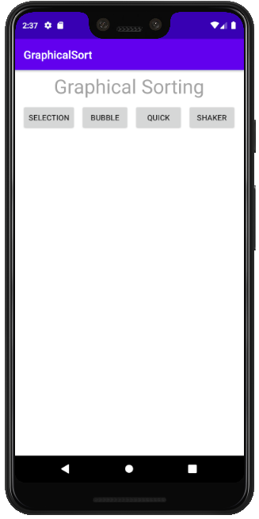
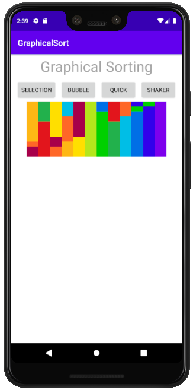
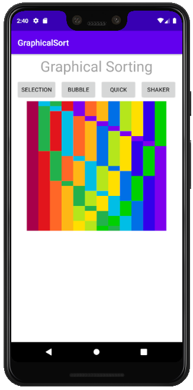
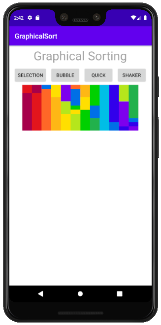
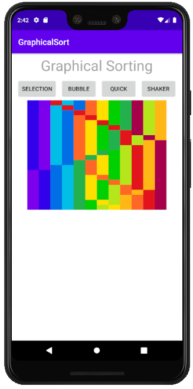

# GraphicalSortingApp

#### The Graphical Sorting App is a rudementary sorting algorithm visualizer that demonstrates the methodology and efficiency of various algorithms through colour sorting.
#### The App was created with the intention of using it as a teaching tool to help students understand sorting algorithms.
#### Functionality programmed in Java and GUI programmed in XML using Android Studio.
#### [Link to Java code](https://github.com/GursherBaath/GraphicalSortingApp/tree/master/app/src/main/java/com/example/graphicalsort/MainActivity.java)
#### [Link to XML code](https://github.com/GursherBaath/GraphicalSortingApp/blob/master/app/src/main/res/layout/activity_main.xml)
## Selection Sort Visuals

## Bubble Sort Visuals

## Quick Sort Visuals

## Shaker Sort Visuals

